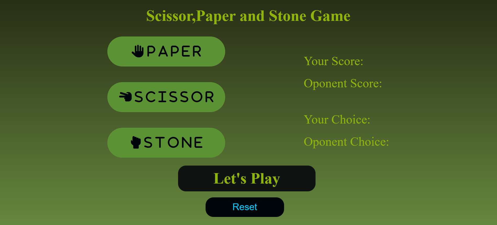

# Paper-Scissor-Stone-Game

<h1>✊✋✌️ Rock Paper Scissors Game</h1>

A simple Rock Paper Scissors game built using HTML, CSS, and JavaScript. The player competes against the computer, which makes a random choice each round. The game displays both choices, shows the result instantly, and keeps track of scores. A reset button allows the game to start again at any time.
